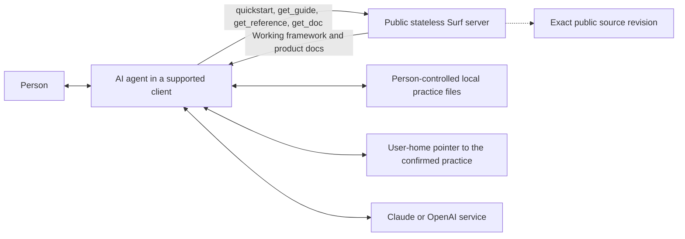

# How Surf works

Surf separates a public rulebook from a person's local learning practice. The server
publishes the current working framework and product documentation. A connected AI agent
retrieves that material and, with the person's agreement, performs any local work.

The arrows are boundaries, not just components. Surf does not mediate the agent's access
to local files. The AI provider remains involved in the agent conversation. The source
link identifies the build running on Surf's managed host.

## The Surf server

Surf is one public HTTP service with no application account, authentication, participant
database, or participant session. Framework and documentation text are compiled into a
build, so a deployment serves fixed content rather than mutable files fetched from a
separate store.

The service exposes:

- `quickstart`, which returns the resident orientation, boundaries, and catalogue;
- `get_guide`, which returns one moment guide for the interaction at hand;
- `get_reference`, which returns cross-cutting knowledge when it is useful;
- `get_doc`, which returns one current product document by topic;
- MCP resources mirroring the working framework and current product documents;
- plain HTTP routes for people and tools that do not use MCP.

The tool surface uses progressive disclosure. The agent starts with the resident
quickstart and normally chooses one primary moment guide. It can consult whichever
references are relevant, beginning focused and expanding when useful. It retrieves
product documentation only when it needs to answer a question about Surf.

Here, **references** are authored framework documents. **MCP resources** are a protocol
delivery primitive that mirrors the catalogue; they are not a second kind of authored
reference.

## The agent

The agent runs in Claude Desktop, ChatGPT Desktop, Claude Code CLI, or Codex CLI. It calls
Surf for guidance and performs filesystem work through the capabilities of that client.
Its learning role is deliberately distinct from a doing-agent that completes the person's
immediate task.

The framework directs the agent to establish consent and a working agreement, verify
durable local file access, preserve selected reports, maintain a correctable person model,
and conduct evidence-led reviews. Surf itself does none of those local operations.

## The local practice

The person confirms a durable, dedicated folder. Inside it, a readable map points to the
current agreement, person understanding, plan, dated reports and reviews, any live
experiment, and the working-framework provenance stamp. The framework uses mapped meanings
rather than assuming that every practice has an identical optional structure.

A separate locator at one documented path in the user's home contains only a schema
version and the confirmed practice's absolute path. On a return, the agent first checks
the launch directory. A valid practice there wins and the locator is not read. Otherwise
the agent reads that one pointer, validates the exact target through its marker, map and
framework record, and fails closed rather than searching broadly when the pointer is
invalid or inaccessible.

This local model provides continuity across conversations while remaining inspectable and
editable. The agent must label provenance, preserve original reports, keep current state
distinct from history, and honour corrections, exclusions, and deletion requests.

Local control is not the same as universal privacy. The agent and AI provider may process
files they access, and the machine, backups, and sharing settings remain separate
boundaries. See [privacy and data](https://github.com/withnative/surf/blob/main/docs/privacy-and-data.md).

## One working framework

Surf currently develops one freely revisable pre-production framework, labelled `0.1.0`.
The label is a simple provenance stamp, not a promise that every development draft remains
available or compatible. The server returns the current `0.1.0` content without installed,
available, acknowledged, migration-target, or exact-version inputs.

Git history and workspace decisions preserve the development record. Strict semantic
versioning, immutable published framework versions, migrations, and historical retrieval
begin when a real production practice depends on a particular framework version. Until
then, the team improves `0.1.0` directly.

## Product documentation

Markdown files under `docs/` are the canonical product explanations. The exact same bytes
are exposed through:

- GitHub;
- `https://surf.withnative.ai/docs/{slug}`;
- `surf://docs/{slug}`;
- `get_doc(topic)`.

The duplication is in delivery, not authorship. Parity tests prevent the HTTP, resource,
and tool versions from diverging from the repository file. These current explanations do
not replace operating guidance from `quickstart`, `get_guide`, and `get_reference`.

## Builds and source revisions

Every production build identifies the Surf application version, working framework version,
full Git commit, and canonical URL for that immutable source revision. The landing page,
MCP metadata, `surf://source`, and `/source` make that relationship visible. A visitor can
therefore move from the running service to the source that produced it rather than only to
a moving repository homepage.

Read [working framework and source](https://github.com/withnative/surf/blob/main/docs/releases-and-source.md)
for the complete development and source model.
